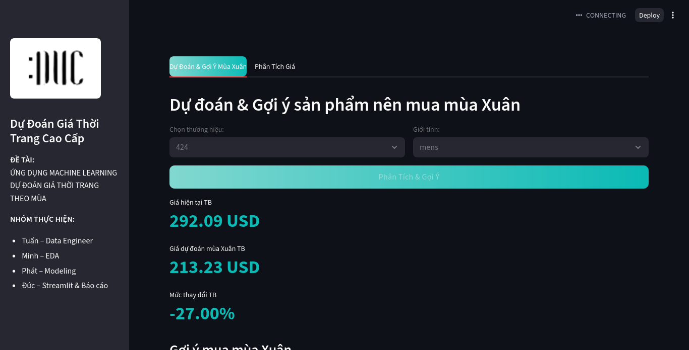
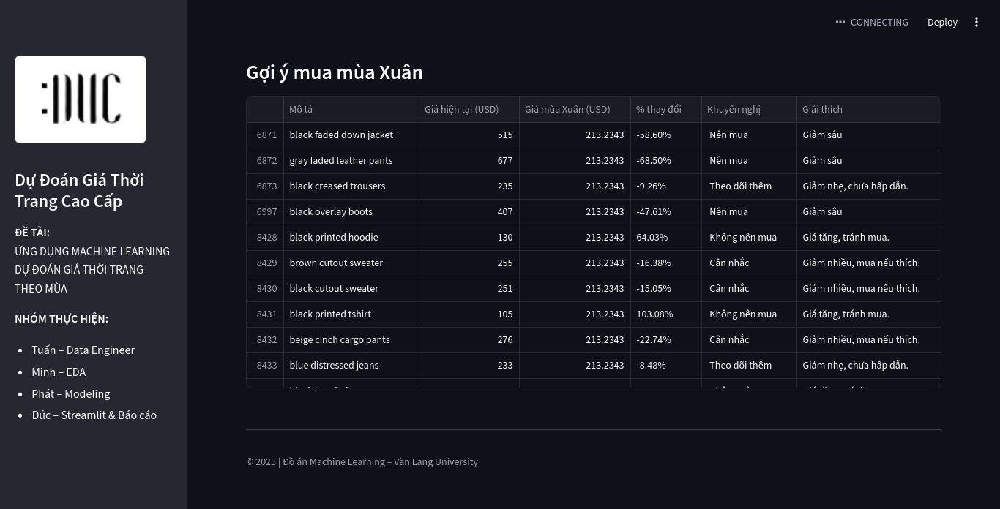

# 💎 Dự Đoán Giá Thời Trang Cao Cấp

> Ứng dụng web Streamlit phục vụ cho đồ án "Ứng dụng Machine Learning Dự Đoán Giá Thời Trang Theo Mùa".

## ℹ️ Về Đồ Án



  * **Đề tài:** Ứng dụng Machine Learning Dự Đoán Giá Thời Trang Theo Mùa
  * **Trường:** Văn Lang University
  * **Năm:** 2025
  
## ✨ Tính Năng Chính

Ứng dụng được chia làm hai tab chính:

### 1\. 📈 Dự Đoán & Gợi Ý Mùa Xuân

Tab này cho phép người dùng nhận các gợi ý mua hàng cho mùa Xuân dựa trên giá dự đoán.

  * **Lựa chọn đầu vào:** Người dùng chọn **Thương hiệu** và **Giới tính** (loại sản phẩm).
  * **Phân tích & Gợi ý:** Khi nhấn nút, ứng dụng sẽ:
      * Tải tệp `results/price_forecast.csv` (đã được tạo từ trước).
      * Tính toán phần trăm thay đổi giá (`change_rate`) giữa giá hiện tại và giá dự đoán mùa Xuân.
      * Đưa ra các **Khuyến nghị** ("Nên mua", "Cân nhắc", "Theo dõi thêm", "Không nên mua") dựa trên mức độ giảm giá.
      * Hiển thị các chỉ số tóm tắt (Giá TB hiện tại, Giá TB dự đoán, % thay đổi TB).
      * Hiển thị bảng dữ liệu chi tiết các sản phẩm được lọc.

### 2\. 📊 Phân Tích Giá

Tab này cho phép người dùng so sánh mức giá trung bình của một thương hiệu với các thương hiệu khác.

  * **Lựa chọn đầu vào:** Người dùng chọn một **Thương hiệu**.
  * **Phân tích:** Ứng dụng sẽ:
      * Hiển thị giá trung bình của thương hiệu đã chọn.
      * Tìm và hiển thị 5 thương hiệu khác có mức giá trung bình tương đương (trong khoảng ±30% so với thương hiệu đã chọn).

## 🗂 Cấu Trúc Thư Mục Dự Án

Để ứng dụng này chạy đúng, cấu trúc thư mục của bạn cần phải tuân theo
(Các tệp và thư mục được suy ra từ mã nguồn):

```
.
├── app.py                      # Tệp mã nguồn Streamlit bạn đã cung cấp
├── models/
│   └── season_price_predict.pkl    # Mô hình ML đã huấn luyện
├── data/
│   └── processed/
│       └── ssense_clean.csv    # Dữ liệu đã làm sạch
├── results/
│   └── price_forecast.csv      # Kết quả dự đoán (được tạo bởi một tập lệnh khác)
├── images/
│   └── logo.png                # Logo hiển thị trên sidebar
└── requirements.txt            # Tệp chứa các thư viện cần thiết
```

**Lưu ý quan trọng:** Tệp `results/price_forecast.csv` **phải tồn tại** trước khi chạy ứng dụng để Tab 1 hoạt động. Ứng dụng này không tự chạy mô hình để tạo ra tệp này.

## 🚀 Cài Đặt & Chạy Ứng Dụng

### 1\. Yêu cầu

  * [Python 3.8+](https://www.python.org/downloads/)
  * [pip](https://pip.pypa.io/en/stable/installation/) (trình quản lý gói của Python)

### 2\. Cài đặt thư viện

Bạn nên tạo một môi trường ảo (virtual environment) để tránh xung đột thư viện.

```bash
# Tạo môi trường ảo
python -m venv venv
# Kích hoạt môi trường ảo
# Trên Windows:
venv\Scripts\activate
# Trên macOS/Linux:
source venv/bin/activate
```

Tạo một tệp `requirements.txt` với nội dung sau:

```ini
streamlit
pandas
numpy
scikit-learn
```

Sau đó, cài đặt các thư viện:

```bash
pip install -r requirements.txt
```

### 3\. Chạy ứng dụng

Sau khi đã cài đặt đầy đủ thư viện và đảm bảo các tệp dữ liệu (`.csv`, `.pkl`, `.png`) nằm đúng vị trí, hãy chạy lệnh sau từ terminal của bạn:

```bash
streamlit run app.py
```

Ứng dụng sẽ tự động mở trong trình duyệt web của bạn.

## 👥 Nhóm Thực Hiện

  * **Tuấn** – Data Engineer
  * **Minh** – EDA (Phân tích dữ liệu khám phá)
  * **Phát** – Modeling (Xây dựng mô hình)
  * **Đức** – Streamlit & Báo cáo

-----

*© 2025 | Đồ án Machine Learning – Văn Lang University*